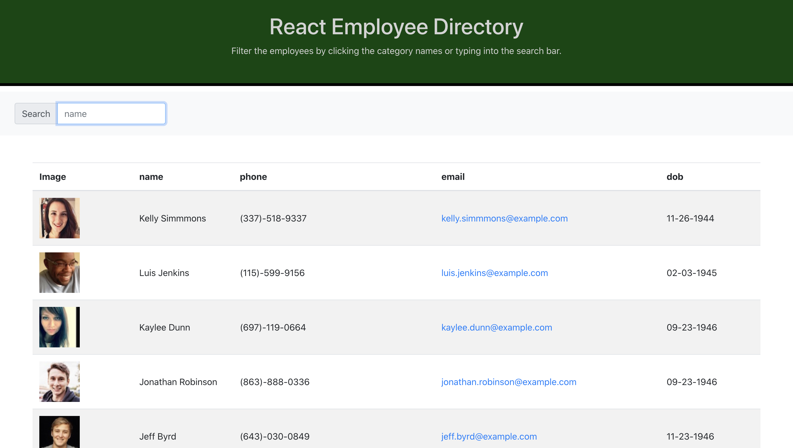

# React-Employee-Directory

## Description

This application is used to store employees within a company with their contact information and date of birth. You can sort in ascending or descending order based off of name, phone number, email, and date of birth. You can also search the employees by name if you are looking for a particular employee. This application uses the [Random User API](https://randomuser.me/) to have the employees generate.

## Table of Contents 

* [Installation](#installation)

* [Usage](#usage)

* [License](#license)

* [Contributing](#contributing)

* [Tests](#tests)

* [Questions](#questions)

* [Screenshot](#screenshot)

* [Demo](#demo)

## Installation

To install necessary dependencies, run the following command:

`
npm i
`

## Usage

Once the dependencies are installed, you can run `npm start` to start react scripts and the application will open up in the default browser.

## License

This project is licensed under GPL-3.0.
  
## Contributing

Anyone, just be sure to credit.

## Tests

To run tests, run the following command:

`
npm test
`

## Questions

If you have any questions about the repo,please contact me at drfrank22@gmail.com.

## Screenshot

## Demo

